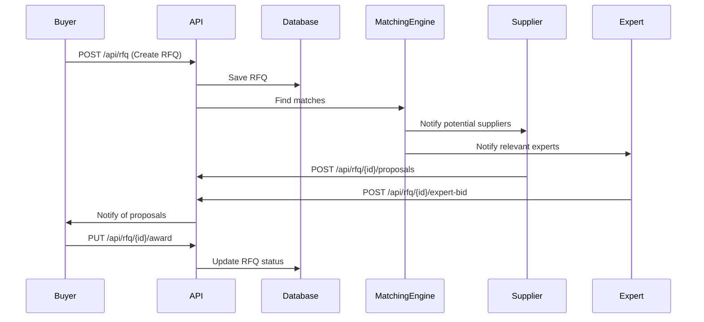

# RFQ (Request for Quote) API

## Overview
The RFQ system is the core of the FoodXchange marketplace, enabling buyers to request quotes from suppliers and experts. This API handles the complete RFQ lifecycle from creation to fulfillment.

⚠️ **Implementation Status**: The RFQ API is currently in development. This documentation reflects the planned implementation based on the codebase analysis.

## RFQ Workflow



## Endpoints

### POST /api/rfq
Create a new Request for Quote.

**Authentication**: Required (Buyer role)

**Request Body:**
```json
{
  "title": "Premium Organic Apples - 1000kg",
  "description": "High-quality organic apples for juice production. Must be certified organic and non-GMO.",
  "category": "64f5a8b9c123456789abcdef",
  "requirements": {
    "quantity": 1000,
    "unit": "kg",
    "deliveryDate": "2024-03-15T00:00:00Z",
    "deliveryLocation": {
      "address": "123 Production Facility St",
      "city": "Portland",
      "state": "OR",
      "zipCode": "97201",
      "country": "USA"
    },
    "paymentTerms": "NET30",
    "certifications": [
      {
        "name": "USDA Organic",
        "required": true
      },
      {
        "name": "Non-GMO Project Verified",
        "required": true
      },
      {
        "name": "Fair Trade",
        "required": false
      }
    ],
    "qualitySpecs": {
      "grade": "Premium",
      "size": "80-85mm diameter",
      "color": "Red/Green mix",
      "sugarContent": "≥12 Brix"
    }
  },
  "budget": {
    "currency": "USD",
    "maxPricePerUnit": 3.50,
    "totalBudget": 3500.00
  },
  "proposalDeadline": "2024-02-28T23:59:59Z",
  "expertiseRequired": true,
  "visibility": "public",
  "tags": ["organic", "apples", "juice-production", "premium"]
}
```

**Response (201 Created):**
```json
{
  "success": true,
  "data": {
    "rfqId": "64f5a8b9c123456789abcdef",
    "rfqNumber": "RFQ-240115",
    "status": "draft",
    "title": "Premium Organic Apples - 1000kg",
    "createdAt": "2024-01-15T10:30:00Z",
    "proposalDeadline": "2024-02-28T23:59:59Z",
    "estimatedMatches": {
      "suppliers": 8,
      "experts": 3
    }
  },
  "meta": {
    "nextSteps": [
      "Review and publish RFQ",
      "Monitor for supplier proposals",
      "Engage with matched experts"
    ]
  }
}
```

**Validation Rules:**
- Delivery date must be at least 7 days in the future
- Proposal deadline must be before delivery date
- Budget must be greater than 0
- At least one certification or quality specification required
- Title must be 10-100 characters

### GET /api/rfq
List RFQs with filtering and pagination.

**Authentication**: Required

**Query Parameters:**
```
?status=published,open
&category=64f5a8b9c123456789abcdef
&deliveryLocation.city=Portland
&deliveryDate.from=2024-01-01
&deliveryDate.to=2024-12-31
&budget.min=1000
&budget.max=10000
&tags=organic,premium
&expertiseRequired=true
&page=1
&limit=20
&sort=createdAt
&order=desc
```

**Response (200 OK):**
```json
{
  "success": true,
  "data": [
    {
      "rfqId": "64f5a8b9c123456789abcdef",
      "rfqNumber": "RFQ-240115",
      "title": "Premium Organic Apples - 1000kg",
      "status": "published",
      "category": {
        "id": "64f5a8b9c123456789abcdef",
        "name": "Fresh Produce",
        "subcategory": "Apples"
      },
      "buyer": {
        "id": "64f5a8b9c123456789abcde0",
        "companyName": "Pacific Juice Co.",
        "verified": true
      },
      "requirements": {
        "quantity": 1000,
        "unit": "kg",
        "deliveryDate": "2024-03-15T00:00:00Z",
        "deliveryLocation": {
          "city": "Portland",
          "state": "OR",
          "country": "USA"
        }
      },
      "budget": {
        "currency": "USD",
        "maxPricePerUnit": 3.50
      },
      "proposalDeadline": "2024-02-28T23:59:59Z",
      "proposalCount": 5,
      "expertMatches": 2,
      "createdAt": "2024-01-15T10:30:00Z",
      "tags": ["organic", "apples", "premium"]
    }
  ],
  "pagination": {
    "currentPage": 1,
    "totalPages": 5,
    "totalItems": 97,
    "itemsPerPage": 20,
    "hasNext": true,
    "hasPrev": false
  },
  "filters": {
    "applied": {
      "status": ["published", "open"],
      "expertiseRequired": true
    },
    "available": {
      "categories": [
        {"id": "cat1", "name": "Fresh Produce", "count": 45},
        {"id": "cat2", "name": "Dairy", "count": 23}
      ],
      "locations": [
        {"city": "Portland", "state": "OR", "count": 12},
        {"city": "Seattle", "state": "WA", "count": 8}
      ]
    }
  }
}
```

### GET /api/rfq/{rfqId}
Get detailed information about a specific RFQ.

**Authentication**: Required

**Path Parameters:**
- `rfqId` (string): Unique RFQ identifier

**Response (200 OK):**
```json
{
  "success": true,
  "data": {
    "rfqId": "64f5a8b9c123456789abcdef",
    "rfqNumber": "RFQ-240115",
    "title": "Premium Organic Apples - 1000kg",
    "description": "High-quality organic apples for juice production...",
    "status": "published",
    "category": {
      "id": "64f5a8b9c123456789abcdef",
      "name": "Fresh Produce",
      "subcategory": "Apples",
      "specifications": ["Grade", "Size", "Color", "Sugar Content"]
    },
    "buyer": {
      "id": "64f5a8b9c123456789abcde0",
      "companyName": "Pacific Juice Co.",
      "contactPerson": "John Smith",
      "verified": true,
      "rating": 4.8,
      "completedOrders": 156
    },
    "requirements": {
      "quantity": 1000,
      "unit": "kg",
      "deliveryDate": "2024-03-15T00:00:00Z",
      "deliveryLocation": {
        "address": "123 Production Facility St",
        "city": "Portland",
        "state": "OR",
        "zipCode": "97201",
        "country": "USA",
        "coordinates": {
          "lat": 45.5152,
          "lng": -122.6784
        }
      },
      "paymentTerms": "NET30",
      "certifications": [
        {"name": "USDA Organic", "required": true, "verified": false},
        {"name": "Non-GMO Project Verified", "required": true, "verified": false}
      ],
      "qualitySpecs": {
        "grade": "Premium",
        "size": "80-85mm diameter",
        "color": "Red/Green mix",
        "sugarContent": "≥12 Brix"
      }
    },
    "budget": {
      "currency": "USD",
      "maxPricePerUnit": 3.50,
      "totalBudget": 3500.00,
      "negotiable": true
    },
    "timeline": {
      "createdAt": "2024-01-15T10:30:00Z",
      "publishedAt": "2024-01-15T11:00:00Z",
      "proposalDeadline": "2024-02-28T23:59:59Z",
      "deliveryDate": "2024-03-15T00:00:00Z"
    },
    "proposals": {
      "count": 5,
      "averagePrice": 3.25,
      "priceRange": {"min": 2.95, "max": 3.45},
      "topProposals": 3
    },
    "expertMatches": [
      {
        "expertId": "64f5a8b9c123456789abcde1",
        "name": "Dr. Sarah Wilson",
        "expertise": "Organic Certification",
        "rating": 4.9,
        "hourlyRate": 150,
        "available": true
      }
    ],
    "compliance": {
      "required": ["USDA Organic", "FDA Food Safety"],
      "status": "pending_verification",
      "documents": []
    },
    "tags": ["organic", "apples", "juice-production", "premium"],
    "visibility": "public",
    "expertiseRequired": true
  }
}
```

### POST /api/rfq/{rfqId}/proposals
Submit a proposal for an RFQ.

**Authentication**: Required (Supplier role)

**Path Parameters:**
- `rfqId` (string): RFQ identifier

**Request Body:**
```json
{
  "pricing": {
    "unitPrice": 3.25,
    "currency": "USD",
    "totalPrice": 3250.00,
    "validUntil": "2024-03-01T23:59:59Z",
    "discounts": [
      {
        "condition": "Volume > 2000kg",
        "discount": 5,
        "type": "percentage"
      }
    ]
  },
  "delivery": {
    "leadTime": 14,
    "leadTimeUnit": "days",
    "earliestDelivery": "2024-03-01T00:00:00Z",
    "shippingMethod": "Refrigerated truck",
    "shippingCost": 150.00,
    "deliveryFlexibility": "±3 days"
  },
  "compliance": {
    "certifications": [
      {
        "name": "USDA Organic",
        "certificateNumber": "USDA-ORG-12345",
        "expiryDate": "2024-12-31T00:00:00Z",
        "documentUrl": "https://storage.azure.com/certs/usda-org-12345.pdf"
      }
    ],
    "qualityAssurance": {
      "gradeGuarantee": "Premium",
      "qualityControlProcess": "Third-party inspection",
      "sampleAvailable": true
    }
  },
  "supplier": {
    "farmLocation": "Washington State",
    "harvestDate": "2024-02-15T00:00:00Z",
    "storageConditions": "Controlled atmosphere, 32°F",
    "packagingOptions": ["Bulk bins", "Retail bags", "Custom packaging"]
  },
  "additionalServices": {
    "qualityInspection": true,
    "customPackaging": true,
    "expeditedShipping": true,
    "paymentTermsFlexible": true
  },
  "notes": "Premium apples from our certified organic orchard in Yakima Valley. Can provide samples for quality testing.",
  "attachments": [
    {
      "name": "Quality Specification Sheet",
      "url": "https://storage.azure.com/docs/quality-specs.pdf",
      "type": "pdf"
    }
  ]
}
```

**Response (201 Created):**
```json
{
  "success": true,
  "data": {
    "proposalId": "64f5a8b9c123456789abcde2",
    "rfqId": "64f5a8b9c123456789abcdef",
    "status": "submitted",
    "submittedAt": "2024-01-20T14:30:00Z",
    "pricing": {
      "unitPrice": 3.25,
      "totalPrice": 3250.00,
      "validUntil": "2024-03-01T23:59:59Z"
    },
    "competitiveRanking": {
      "priceRank": 2,
      "totalProposals": 5,
      "scoreOutOf100": 87
    }
  },
  "meta": {
    "nextSteps": [
      "Buyer will review proposal",
      "Potential follow-up questions",
      "Decision by proposal deadline"
    ]
  }
}
```

### GET /api/rfq/{rfqId}/proposals
Get all proposals for an RFQ (Buyer only).

**Authentication**: Required (RFQ owner only)

**Response (200 OK):**
```json
{
  "success": true,
  "data": [
    {
      "proposalId": "64f5a8b9c123456789abcde2",
      "supplier": {
        "id": "64f5a8b9c123456789abcde3",
        "companyName": "Yakima Valley Organics",
        "rating": 4.7,
        "completedOrders": 89,
        "verified": true,
        "location": "Washington State"
      },
      "pricing": {
        "unitPrice": 3.25,
        "totalPrice": 3250.00,
        "shippingCost": 150.00,
        "validUntil": "2024-03-01T23:59:59Z"
      },
      "delivery": {
        "leadTime": 14,
        "earliestDelivery": "2024-03-01T00:00:00Z",
        "shippingMethod": "Refrigerated truck"
      },
      "compliance": {
        "certificationsCount": 3,
        "allRequirementsMet": true,
        "qualityScore": 95
      },
      "score": {
        "overall": 87,
        "price": 85,
        "quality": 95,
        "delivery": 82,
        "supplier": 88
      },
      "status": "submitted",
      "submittedAt": "2024-01-20T14:30:00Z"
    }
  ],
  "summary": {
    "totalProposals": 5,
    "averagePrice": 3.25,
    "priceRange": {"min": 2.95, "max": 3.45},
    "averageLeadTime": 12,
    "complianceRate": 80
  }
}
```

### PUT /api/rfq/{rfqId}/award
Award the RFQ to a selected supplier.

**Authentication**: Required (RFQ owner only)

**Request Body:**
```json
{
  "proposalId": "64f5a8b9c123456789abcde2",
  "awardReason": "Best combination of price, quality, and delivery time",
  "negotiatedTerms": {
    "finalPrice": 3.20,
    "paymentTerms": "NET30",
    "deliveryDate": "2024-03-10T00:00:00Z"
  },
  "contractDetails": {
    "purchaseOrderNumber": "PO-2024-001",
    "specialInstructions": "Require quality inspection upon delivery"
  }
}
```

**Response (200 OK):**
```json
{
  "success": true,
  "data": {
    "rfqId": "64f5a8b9c123456789abcdef",
    "status": "awarded",
    "awardedProposal": "64f5a8b9c123456789abcde2",
    "awardedAt": "2024-01-25T16:45:00Z",
    "orderDetails": {
      "orderId": "64f5a8b9c123456789abcde4",
      "purchaseOrderNumber": "PO-2024-001",
      "finalPrice": 3.20,
      "totalAmount": 3200.00
    }
  },
  "meta": {
    "nextSteps": [
      "Purchase order will be generated",
      "Supplier will be notified",
      "Other suppliers will be notified of decision",
      "Order tracking begins"
    ]
  }
}
```

## Expert Integration

### POST /api/rfq/{rfqId}/expert-consultation
Request expert consultation for an RFQ.

**Authentication**: Required

**Request Body:**
```json
{
  "expertId": "64f5a8b9c123456789abcde1",
  "consultationType": "compliance_review",
  "questions": [
    "Can you verify the organic certification requirements?",
    "What additional food safety measures should we consider?"
  ],
  "urgency": "high",
  "budget": {
    "hourlyRate": 150,
    "maxHours": 2
  }
}
```

## Error Codes

### RFQ-Specific Errors

| Code | HTTP Status | Description |
|------|-------------|-------------|
| `RFQ_NOT_FOUND` | 404 | RFQ does not exist |
| `RFQ_ACCESS_DENIED` | 403 | User cannot access this RFQ |
| `RFQ_INVALID_STATUS` | 400 | Operation not allowed in current status |
| `RFQ_DEADLINE_PASSED` | 400 | Proposal deadline has passed |
| `RFQ_INVALID_DELIVERY_DATE` | 400 | Delivery date must be at least 7 days future |
| `RFQ_BUDGET_REQUIRED` | 400 | Budget information is required |
| `RFQ_DUPLICATE_PROPOSAL` | 409 | Supplier already submitted proposal |
| `RFQ_PROPOSAL_LIMIT_EXCEEDED` | 429 | Maximum proposals reached |

### Example Error Response
```json
{
  "success": false,
  "error": {
    "code": "RFQ_DEADLINE_PASSED",
    "message": "Cannot submit proposal after deadline",
    "details": {
      "deadline": "2024-02-28T23:59:59Z",
      "currentTime": "2024-03-01T10:30:00Z"
    },
    "timestamp": "2024-03-01T10:30:00Z"
  }
}
```

## Business Rules

### RFQ Lifecycle Rules
1. **Draft → Published**: Requires all mandatory fields
2. **Published → Closed**: Automatic on proposal deadline
3. **Published → Awarded**: Manual by buyer
4. **Awarded → Completed**: When order is fulfilled

### Proposal Rules
- Maximum 50 proposals per RFQ
- Suppliers can submit only one proposal per RFQ
- Proposals cannot be edited after submission
- Proposals automatically expire with RFQ deadline

### Expert Matching Rules
- Experts matched based on category expertise
- Minimum 4.0 rating required for automatic matching
- Geographic preference (same region priority)
- Availability check during RFQ timeline

## Testing

### Example Test Cases
```javascript
describe('RFQ API', () => {
  it('should create RFQ with valid data', async () => {
    const rfqData = {
      title: "Test RFQ",
      category: "64f5a8b9c123456789abcdef",
      requirements: {
        quantity: 100,
        unit: "kg",
        deliveryDate: "2024-03-15T00:00:00Z"
      }
    };
    
    const response = await request(app)
      .post('/api/rfq')
      .set('Authorization', `Bearer ${buyerToken}`)
      .send(rfqData);
    
    expect(response.status).toBe(201);
    expect(response.body.data.rfqNumber).toMatch(/^RFQ-\d{6}$/);
  });
});
```

## Implementation Notes

⚠️ **Current Status**: The RFQ API endpoints are defined in the route files but many return placeholder responses. The actual business logic implementation is in progress.

**Priority Implementation Order:**
1. Basic CRUD operations for RFQs
2. Proposal submission and management
3. Expert matching integration
4. Advanced filtering and search
5. Real-time notifications for status changes