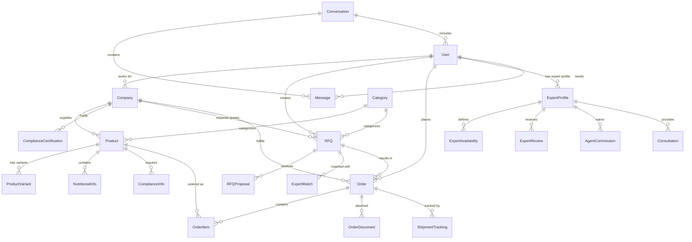

# Database Schema Documentation

## Overview
FoodXchange uses MongoDB as the primary database with Mongoose ODM for schema definition and validation. The database design supports complex B2B food commerce workflows including RFQ management, compliance tracking, expert consultations, and multi-company relationships.

## Database Architecture

### Connection Configuration
```javascript
// Database connection settings
const config = {
  uri: process.env.MONGODB_URI || 'mongodb://localhost:27017/foodxchange',
  options: {
    retryWrites: true,
    w: 'majority',
    maxPoolSize: 10,
    minPoolSize: 5,
    maxIdleTimeMS: 30000,
    serverSelectionTimeoutMS: 5000,
    heartbeatFrequencyMS: 10000
  }
};
```

### Collections Overview

| Collection | Purpose | Estimated Size | Critical Indexes |
|------------|---------|----------------|------------------|
| `users` | User accounts and profiles | 10K-100K | email, role, company |
| `companies` | Business entities | 1K-10K | name, verification_status |
| `products` | Product catalog | 100K-1M | category, supplier, name (text) |
| `rfqs` | Request for quotes | 10K-100K | buyer, status, category, delivery_date |
| `orders` | Purchase orders | 50K-500K | buyer, seller, status, created_date |
| `expert_profiles` | Expert information | 1K-5K | expertise, location, rating |
| `agent_profiles` | Sales agent data | 100-1K | territory, commission_rate |
| `compliance_docs` | Compliance certificates | 10K-50K | type, expiry_date, entity |
| `categories` | Product categories | 100-1K | name, parent_category |
| `conversations` | Messages and chat | 100K-1M | participants, rfq_context |

## Core Schemas

### User Schema (`/src/models/User.ts`)

```javascript
const userSchema = new mongoose.Schema({
  // Authentication
  email: {
    type: String,
    required: true,
    unique: true,
    lowercase: true,
    trim: true,
    validate: {
      validator: (email) => /^[^\s@]+@[^\s@]+\.[^\s@]+$/.test(email),
      message: 'Invalid email format'
    }
  },
  
  password: {
    type: String,
    required: true,
    minlength: 8,
    select: false // Never return password in queries
  },
  
  // Personal Information
  firstName: {
    type: String,
    required: true,
    trim: true,
    maxlength: 50
  },
  
  lastName: {
    type: String,
    required: true,
    trim: true,
    maxlength: 50
  },
  
  phone: {
    type: String,
    validate: {
      validator: (phone) => /^\+?[\d\s\-\(\)]+$/.test(phone),
      message: 'Invalid phone format'
    }
  },
  
  // Role and Permissions
  role: {
    type: String,
    enum: ['buyer', 'seller', 'admin', 'contractor', 'agent'],
    required: true,
    default: 'buyer'
  },
  
  // Company Association
  company: {
    type: mongoose.Schema.Types.ObjectId,
    ref: 'Company',
    required: function() {
      return ['seller', 'buyer'].includes(this.role);
    }
  },
  
  // Account Status
  accountStatus: {
    type: String,
    enum: ['active', 'inactive', 'locked', 'suspended'],
    default: 'active'
  },
  
  // Verification
  emailVerified: {
    type: Boolean,
    default: false
  },
  
  companyVerified: {
    type: Boolean,
    default: false
  },
  
  // Profile Information
  profileCompletionPercentage: {
    type: Number,
    min: 0,
    max: 100,
    default: 0
  },
  
  // Preferences
  preferences: {
    notifications: {
      email: { type: Boolean, default: true },
      sms: { type: Boolean, default: false },
      push: { type: Boolean, default: true }
    },
    language: {
      type: String,
      default: 'en',
      enum: ['en', 'es', 'fr', 'de', 'zh']
    },
    timezone: {
      type: String,
      default: 'UTC'
    },
    currency: {
      type: String,
      default: 'USD',
      enum: ['USD', 'EUR', 'GBP', 'CAD', 'AUD']
    }
  },
  
  // Security
  lastLogin: Date,
  failedLoginAttempts: {
    type: Number,
    default: 0
  },
  accountLockedUntil: Date,
  
  // Verification Documents
  verificationDocuments: [{
    type: {
      type: String,
      enum: ['identity', 'business_license', 'tax_id', 'insurance'],
      required: true
    },
    url: {
      type: String,
      required: true
    },
    fileName: String,
    uploadedAt: {
      type: Date,
      default: Date.now
    },
    verified: {
      type: Boolean,
      default: false
    },
    verifiedAt: Date,
    verifiedBy: {
      type: mongoose.Schema.Types.ObjectId,
      ref: 'User'
    },
    expiryDate: Date
  }]
}, {
  timestamps: true,
  toJSON: { virtuals: true },
  toObject: { virtuals: true }
});

// Indexes
userSchema.index({ email: 1 }, { unique: true });
userSchema.index({ role: 1, accountStatus: 1 });
userSchema.index({ company: 1, role: 1 });
userSchema.index({ 'verificationDocuments.verified': 1 });

// Virtual for full name
userSchema.virtual('fullName').get(function() {
  return `${this.firstName} ${this.lastName}`;
});

// Pre-save middleware for password hashing
userSchema.pre('save', async function(next) {
  if (!this.isModified('password')) return next();
  this.password = await bcrypt.hash(this.password, 12);
  next();
});
```

### Company Schema (`/src/models/Company.ts`)

```javascript
const companySchema = new mongoose.Schema({
  // Basic Information
  name: {
    type: String,
    required: true,
    trim: true,
    maxlength: 100
  },
  
  legalName: {
    type: String,
    trim: true,
    maxlength: 150
  },
  
  description: {
    type: String,
    maxlength: 1000
  },
  
  website: {
    type: String,
    validate: {
      validator: (url) => /^https?:\/\/.+/.test(url),
      message: 'Invalid website URL'
    }
  },
  
  // Business Information
  businessType: {
    type: String,
    enum: ['supplier', 'buyer', 'both', 'service_provider'],
    required: true
  },
  
  industry: {
    type: String,
    enum: [
      'fresh_produce', 'dairy', 'meat_poultry', 'seafood', 'grains_cereals',
      'beverages', 'processed_foods', 'organic', 'specialty_foods',
      'food_service', 'retail', 'distribution', 'manufacturing'
    ],
    required: true
  },
  
  // Contact Information
  contactInfo: {
    primaryContact: {
      name: String,
      title: String,
      email: String,
      phone: String
    },
    salesContact: {
      name: String,
      email: String,
      phone: String
    },
    supportContact: {
      name: String,
      email: String,
      phone: String
    }
  },
  
  // Address Information
  addresses: [{
    type: {
      type: String,
      enum: ['headquarters', 'warehouse', 'production', 'shipping'],
      required: true
    },
    street: { type: String, required: true },
    city: { type: String, required: true },
    state: { type: String, required: true },
    zipCode: { type: String, required: true },
    country: { type: String, required: true, default: 'USA' },
    coordinates: {
      lat: { type: Number, min: -90, max: 90 },
      lng: { type: Number, min: -180, max: 180 }
    },
    isPrimary: { type: Boolean, default: false }
  }],
  
  // Verification Status
  verificationStatus: {
    type: String,
    enum: ['unverified', 'pending', 'verified', 'rejected'],
    default: 'unverified'
  },
  
  verificationDetails: {
    verifiedAt: Date,
    verifiedBy: {
      type: mongoose.Schema.Types.ObjectId,
      ref: 'User'
    },
    businessLicense: {
      number: String,
      issuingAuthority: String,
      expiryDate: Date,
      documentUrl: String
    },
    taxId: {
      number: String,
      type: {
        type: String,
        enum: ['EIN', 'SSN', 'VAT', 'GST']
      }
    },
    duns: String // D-U-N-S Number
  },
  
  // Business Metrics
  businessMetrics: {
    yearFounded: {
      type: Number,
      min: 1800,
      max: new Date().getFullYear()
    },
    employeeCount: {
      type: String,
      enum: ['1-10', '11-50', '51-200', '201-500', '501-1000', '1000+']
    },
    annualRevenue: {
      type: String,
      enum: ['<1M', '1M-10M', '10M-50M', '50M-100M', '100M+']
    },
    certifications: [{
      name: String,
      number: String,
      issuingBody: String,
      obtainedDate: Date,
      expiryDate: Date,
      documentUrl: String
    }]
  },
  
  // Trading Information
  tradingProfile: {
    preferredPaymentTerms: [String],
    creditLimit: Number,
    creditRating: {
      score: { type: Number, min: 0, max: 100 },
      agency: String,
      lastUpdated: Date
    },
    insuranceInfo: {
      provider: String,
      policyNumber: String,
      coverage: Number,
      expiryDate: Date
    }
  },
  
  // Platform Statistics
  platformStats: {
    joinedDate: {
      type: Date,
      default: Date.now
    },
    lastActiveDate: Date,
    totalOrders: {
      type: Number,
      default: 0
    },
    completedOrders: {
      type: Number,
      default: 0
    },
    rating: {
      average: {
        type: Number,
        min: 0,
        max: 5,
        default: 0
      },
      count: {
        type: Number,
        default: 0
      }
    }
  }
}, {
  timestamps: true,
  toJSON: { virtuals: true }
});

// Indexes
companySchema.index({ name: 'text', description: 'text' });
companySchema.index({ businessType: 1, industry: 1 });
companySchema.index({ verificationStatus: 1 });
companySchema.index({ 'addresses.city': 1, 'addresses.state': 1 });
companySchema.index({ 'platformStats.rating.average': -1 });
```

### RFQ Schema (`/src/models/RFQ.ts`)

```javascript
const rfqSchema = new mongoose.Schema({
  // Identification
  rfqNumber: {
    type: String,
    unique: true,
    required: true
  },
  
  title: {
    type: String,
    required: true,
    trim: true,
    minlength: 10,
    maxlength: 100
  },
  
  description: {
    type: String,
    required: true,
    maxlength: 2000
  },
  
  // Relationships
  buyer: {
    type: mongoose.Schema.Types.ObjectId,
    ref: 'Company',
    required: true
  },
  
  buyerContact: {
    type: mongoose.Schema.Types.ObjectId,
    ref: 'User',
    required: true
  },
  
  category: {
    type: mongoose.Schema.Types.ObjectId,
    ref: 'Category',
    required: true
  },
  
  // Requirements
  requirements: {
    quantity: {
      type: Number,
      required: true,
      min: 0
    },
    unit: {
      type: String,
      required: true,
      enum: ['kg', 'lb', 'ton', 'case', 'pallet', 'container', 'piece']
    },
    
    // Delivery Information
    deliveryDate: {
      type: Date,
      required: true,
      validate: {
        validator: function(date) {
          const minDate = new Date();
          minDate.setDate(minDate.getDate() + 7);
          return date >= minDate;
        },
        message: 'Delivery date must be at least 7 days in the future'
      }
    },
    
    deliveryLocation: {
      address: { type: String, required: true },
      city: { type: String, required: true },
      state: { type: String, required: true },
      zipCode: { type: String, required: true },
      country: { type: String, required: true, default: 'USA' },
      coordinates: {
        lat: { type: Number, min: -90, max: 90 },
        lng: { type: Number, min: -180, max: 180 }
      },
      specialInstructions: String
    },
    
    // Payment Terms
    paymentTerms: {
      type: String,
      enum: ['NET15', 'NET30', 'NET45', 'NET60', 'COD', 'PREPAID', 'CREDIT_CARD'],
      required: true
    },
    
    // Quality Requirements
    qualitySpecs: {
      grade: String,
      size: String,
      color: String,
      packaging: String,
      shelfLife: String,
      storageRequirements: String,
      customSpecs: mongoose.Schema.Types.Mixed
    },
    
    // Certifications Required
    certifications: [{
      name: {
        type: String,
        required: true
      },
      required: {
        type: Boolean,
        default: true
      },
      preferenceScore: {
        type: Number,
        min: 1,
        max: 10,
        default: 5
      }
    }],
    
    // Additional Requirements
    sampleRequired: {
      type: Boolean,
      default: false
    },
    inspectionRequired: {
      type: Boolean,
      default: false
    },
    customRequirements: String
  },
  
  // Budget Information
  budget: {
    currency: {
      type: String,
      enum: ['USD', 'EUR', 'GBP', 'CAD', 'AUD'],
      default: 'USD'
    },
    maxPricePerUnit: {
      type: Number,
      min: 0
    },
    totalBudget: {
      type: Number,
      min: 0
    },
    negotiable: {
      type: Boolean,
      default: true
    }
  },
  
  // Timeline
  proposalDeadline: {
    type: Date,
    required: true
  },
  
  // Status Management
  status: {
    type: String,
    enum: ['draft', 'published', 'open', 'closed', 'awarded', 'cancelled'],
    default: 'draft'
  },
  
  // Expert Integration
  expertiseRequired: {
    type: Boolean,
    default: false
  },
  
  expertMatches: [{
    expert: {
      type: mongoose.Schema.Types.ObjectId,
      ref: 'ExpertProfile'
    },
    matchScore: {
      type: Number,
      min: 0,
      max: 1
    },
    expertise: [String],
    status: {
      type: String,
      enum: ['matched', 'contacted', 'engaged', 'declined'],
      default: 'matched'
    },
    matchedAt: {
      type: Date,
      default: Date.now
    }
  }],
  
  // Proposals
  proposals: [{
    supplier: {
      type: mongoose.Schema.Types.ObjectId,
      ref: 'Company',
      required: true
    },
    supplierContact: {
      type: mongoose.Schema.Types.ObjectId,
      ref: 'User'
    },
    
    // Pricing
    pricing: {
      unitPrice: {
        type: Number,
        required: true,
        min: 0
      },
      totalPrice: {
        type: Number,
        required: true,
        min: 0
      },
      currency: {
        type: String,
        enum: ['USD', 'EUR', 'GBP', 'CAD', 'AUD'],
        default: 'USD'
      },
      validUntil: {
        type: Date,
        required: true
      },
      discounts: [{
        condition: String,
        discount: Number,
        type: {
          type: String,
          enum: ['percentage', 'fixed']
        }
      }]
    },
    
    // Delivery
    delivery: {
      leadTime: {
        type: Number,
        required: true
      },
      leadTimeUnit: {
        type: String,
        enum: ['days', 'weeks'],
        default: 'days'
      },
      earliestDelivery: Date,
      shippingMethod: String,
      shippingCost: Number,
      deliveryFlexibility: String
    },
    
    // Compliance
    compliance: {
      certifications: [{
        name: String,
        certificateNumber: String,
        expiryDate: Date,
        documentUrl: String
      }],
      qualityAssurance: {
        gradeGuarantee: String,
        qualityControlProcess: String,
        sampleAvailable: Boolean
      }
    },
    
    // Status
    status: {
      type: String,
      enum: ['submitted', 'under_review', 'shortlisted', 'rejected', 'awarded'],
      default: 'submitted'
    },
    
    submittedAt: {
      type: Date,
      default: Date.now
    },
    
    // Additional Information
    notes: String,
    attachments: [{
      name: String,
      url: String,
      type: String
    }]
  }],
  
  // Search and Discovery
  tags: [String],
  visibility: {
    type: String,
    enum: ['public', 'private', 'invited_only'],
    default: 'public'
  },
  
  invitedSuppliers: [{
    type: mongoose.Schema.Types.ObjectId,
    ref: 'Company'
  }],
  
  // Analytics
  analytics: {
    views: {
      type: Number,
      default: 0
    },
    uniqueViews: {
      type: Number,
      default: 0
    },
    viewerIds: [{
      type: mongoose.Schema.Types.ObjectId,
      ref: 'User'
    }]
  }
}, {
  timestamps: true,
  toJSON: { virtuals: true }
});

// Indexes
rfqSchema.index({ buyer: 1, status: 1 });
rfqSchema.index({ category: 1, status: 1 });
rfqSchema.index({ 'requirements.deliveryDate': 1 });
rfqSchema.index({ proposalDeadline: 1 });
rfqSchema.index({ tags: 1 });
rfqSchema.index({ title: 'text', description: 'text' });
rfqSchema.index({ 'requirements.deliveryLocation.city': 1 });
rfqSchema.index({ 'budget.maxPricePerUnit': 1 });

// Virtual for proposal count
rfqSchema.virtual('proposalCount').get(function() {
  return this.proposals.length;
});

// Auto-generate RFQ number
rfqSchema.pre('save', function(next) {
  if (this.isNew && !this.rfqNumber) {
    const timestamp = Date.now().toString().slice(-6);
    this.rfqNumber = `RFQ-${timestamp}`;
  }
  next();
});
```

### Product Schema (`/src/models/Product.ts`)

```javascript
const productSchema = new mongoose.Schema({
  // Basic Information
  name: {
    type: String,
    required: true,
    trim: true,
    maxlength: 100
  },
  
  description: {
    type: String,
    maxlength: 1000
  },
  
  // Relationships
  category: {
    type: mongoose.Schema.Types.ObjectId,
    ref: 'Category',
    required: true
  },
  
  subcategory: String,
  
  supplier: {
    type: mongoose.Schema.Types.ObjectId,
    ref: 'Company',
    required: true
  },
  
  // Product Specifications
  specifications: {
    brand: String,
    model: String,
    sku: String,
    upc: String,
    
    // Physical Properties
    weight: {
      value: Number,
      unit: {
        type: String,
        enum: ['g', 'kg', 'lb', 'oz']
      }
    },
    
    dimensions: {
      length: Number,
      width: Number,
      height: Number,
      unit: {
        type: String,
        enum: ['mm', 'cm', 'm', 'in', 'ft'],
        default: 'cm'
      }
    },
    
    volume: {
      value: Number,
      unit: {
        type: String,
        enum: ['ml', 'l', 'fl_oz', 'gal']
      }
    }
  },
  
  // Nutritional Information
  nutritionalInfo: {
    servingSize: String,
    calories: Number,
    protein: Number,
    carbohydrates: Number,
    fat: Number,
    fiber: Number,
    sugar: Number,
    sodium: Number,
    
    // Allergens
    allergens: [{
      type: String,
      enum: [
        'milk', 'eggs', 'fish', 'shellfish', 'tree_nuts',
        'peanuts', 'wheat', 'soybeans', 'sesame'
      ]
    }],
    
    // Dietary Classifications
    dietaryInfo: {
      organic: Boolean,
      nonGMO: Boolean,
      glutenFree: Boolean,
      kosher: Boolean,
      halal: Boolean,
      vegan: Boolean,
      vegetarian: Boolean
    }
  },
  
  // Pricing
  pricing: {
    basePrice: {
      type: Number,
      required: true,
      min: 0
    },
    currency: {
      type: String,
      enum: ['USD', 'EUR', 'GBP', 'CAD', 'AUD'],
      default: 'USD'
    },
    unit: {
      type: String,
      enum: ['each', 'kg', 'lb', 'case', 'pallet'],
      required: true
    },
    
    // Minimum Order
    minimumOrder: {
      quantity: {
        type: Number,
        required: true,
        min: 1
      },
      unit: String
    },
    
    // Bulk Pricing
    bulkPricing: [{
      minQuantity: {
        type: Number,
        required: true
      },
      price: {
        type: Number,
        required: true
      },
      unit: String
    }]
  },
  
  // Availability
  availability: {
    inStock: {
      type: Boolean,
      default: true
    },
    stockQuantity: {
      type: Number,
      min: 0
    },
    leadTime: {
      min: Number,
      max: Number,
      unit: {
        type: String,
        enum: ['days', 'weeks'],
        default: 'days'
      }
    },
    seasonality: {
      available: Boolean,
      season: String,
      peakMonths: [String]
    }
  },
  
  // Quality and Compliance
  compliance: {
    certifications: [{
      name: String,
      number: String,
      issuingBody: String,
      expiryDate: Date,
      documentUrl: String
    }],
    
    foodSafety: {
      haccp: Boolean,
      sip: Boolean,
      brc: Boolean,
      sqf: Boolean
    },
    
    traceability: {
      lotTracking: Boolean,
      originTracking: Boolean,
      batchNumbers: Boolean
    },
    
    regulatoryInfo: String
  },
  
  // Storage and Handling
  storageRequirements: {
    temperature: {
      min: Number,
      max: Number,
      unit: {
        type: String,
        enum: ['C', 'F'],
        default: 'C'
      }
    },
    humidity: {
      min: Number,
      max: Number
    },
    shelfLife: {
      value: Number,
      unit: {
        type: String,
        enum: ['days', 'weeks', 'months', 'years']
      }
    },
    specialHandling: String
  },
  
  // Media
  images: [{
    url: String,
    alt: String,
    isPrimary: Boolean,
    sortOrder: Number
  }],
  
  documents: [{
    name: String,
    url: String,
    type: {
      type: String,
      enum: ['spec_sheet', 'certificate', 'safety_data', 'nutrition_facts']
    }
  }],
  
  // Status
  isActive: {
    type: Boolean,
    default: true
  },
  
  isPublic: {
    type: Boolean,
    default: true
  },
  
  // Search and Discovery
  tags: [String],
  keywords: [String]
}, {
  timestamps: true,
  toJSON: { virtuals: true }
});

// Indexes
productSchema.index({ name: 'text', description: 'text', tags: 'text' });
productSchema.index({ category: 1, isActive: 1 });
productSchema.index({ supplier: 1, isActive: 1 });
productSchema.index({ 'pricing.basePrice': 1 });
productSchema.index({ 'availability.inStock': 1 });
productSchema.index({ 'nutritionalInfo.allergens': 1 });
productSchema.index({ 'compliance.certifications.name': 1 });
```

### Expert Profile Schema (`/expert-marketplace-service/src/models/ExpertProfile.model.ts`)

```javascript
const expertProfileSchema = new mongoose.Schema({
  // User Reference
  userId: {
    type: mongoose.Schema.Types.ObjectId,
    ref: 'User',
    required: true,
    unique: true
  },
  
  // Basic Information
  firstName: {
    type: String,
    required: true,
    trim: true
  },
  
  lastName: {
    type: String,
    required: true,
    trim: true
  },
  
  email: {
    type: String,
    required: true,
    unique: true
  },
  
  // Profile Information
  headline: {
    type: String,
    maxlength: 200
  },
  
  bio: {
    type: String,
    maxlength: 2000
  },
  
  profilePhoto: String,
  
  // Expertise
  expertise: [{
    category: {
      type: String,
      enum: [
        'food_safety', 'organic_certification', 'nutrition',
        'quality_assurance', 'regulatory_compliance', 'supply_chain',
        'product_development', 'packaging', 'sustainability',
        'international_trade', 'auditing', 'consulting'
      ],
      required: true
    },
    subcategories: [String],
    level: {
      type: String,
      enum: ['junior', 'mid', 'senior', 'expert'],
      required: true
    },
    yearsOfExperience: {
      type: Number,
      min: 0,
      max: 50
    },
    certifications: [String],
    description: String
  }],
  
  // Location
  location: {
    country: {
      type: String,
      required: true
    },
    state: String,
    city: String,
    timezone: {
      type: String,
      required: true
    },
    workRemotely: {
      type: Boolean,
      default: true
    },
    travelWillingness: {
      domestic: Boolean,
      international: Boolean,
      maxDistance: Number
    }
  },
  
  // Professional Background
  education: [{
    degree: String,
    field: String,
    institution: String,
    year: Number,
    verified: {
      type: Boolean,
      default: false
    }
  }],
  
  experience: [{
    company: String,
    position: String,
    startDate: Date,
    endDate: Date,
    description: String,
    achievements: [String],
    verified: {
      type: Boolean,
      default: false
    }
  }],
  
  // Pricing
  hourlyRate: {
    min: {
      type: Number,
      required: true,
      min: 0
    },
    max: {
      type: Number,
      required: true,
      min: 0
    },
    currency: {
      type: String,
      enum: ['USD', 'EUR', 'GBP', 'CAD', 'AUD'],
      default: 'USD'
    },
    negotiable: {
      type: Boolean,
      default: true
    }
  },
  
  // Availability
  availability: [{
    dayOfWeek: {
      type: Number,
      min: 0,
      max: 6,
      required: true
    },
    startTime: {
      type: String,
      required: true,
      match: /^([0-1]?[0-9]|2[0-3]):[0-5][0-9]$/
    },
    endTime: {
      type: String,
      required: true,
      match: /^([0-1]?[0-9]|2[0-3]):[0-5][0-9]$/
    },
    timezone: String
  }],
  
  // Platform Statistics
  rating: {
    average: {
      type: Number,
      min: 0,
      max: 5,
      default: 0
    },
    count: {
      type: Number,
      default: 0
    },
    breakdown: {
      expertise: { type: Number, default: 0 },
      communication: { type: Number, default: 0 },
      timeliness: { type: Number, default: 0 },
      value: { type: Number, default: 0 }
    }
  },
  
  completedProjects: {
    type: Number,
    default: 0
  },
  
  totalEarnings: {
    type: Number,
    default: 0
  },
  
  // Verification
  verificationStatus: {
    type: String,
    enum: ['unverified', 'pending', 'verified', 'expired'],
    default: 'unverified'
  },
  
  verificationDetails: {
    identityVerified: Boolean,
    educationVerified: Boolean,
    experienceVerified: Boolean,
    certificationVerified: Boolean,
    backgroundCheckCompleted: Boolean,
    verifiedAt: Date,
    verifiedBy: {
      type: mongoose.Schema.Types.ObjectId,
      ref: 'User'
    }
  },
  
  // Documents
  documents: [{
    type: {
      type: String,
      enum: ['identity', 'diploma', 'certificate', 'license', 'resume'],
      required: true
    },
    name: String,
    url: String,
    uploadedAt: {
      type: Date,
      default: Date.now
    },
    verified: {
      type: Boolean,
      default: false
    }
  }],
  
  // Platform Settings
  isActive: {
    type: Boolean,
    default: true
  },
  
  isAvailable: {
    type: Boolean,
    default: true
  },
  
  lastActiveDate: Date
}, {
  timestamps: true,
  toJSON: { virtuals: true }
});

// Indexes
expertProfileSchema.index({ 'expertise.category': 1 });
expertProfileSchema.index({ 'location.country': 1 });
expertProfileSchema.index({ 'hourlyRate.min': 1, 'hourlyRate.max': 1 });
expertProfileSchema.index({ 'rating.average': -1 });
expertProfileSchema.index({ verificationStatus: 1 });
expertProfileSchema.index({ isActive: 1, isAvailable: 1 });
```

## Relationships Diagram



## Performance Optimization

### Query Optimization Strategies

```javascript
// Example optimized queries
class ProductService {
  // Use compound indexes for filtering
  async findProducts(filters) {
    return Product.find({
      category: filters.category,
      isActive: true,
      'pricing.basePrice': { 
        $gte: filters.minPrice, 
        $lte: filters.maxPrice 
      }
    })
    .select('name pricing availability supplier')
    .populate('supplier', 'name rating')
    .lean(); // Return plain objects for better performance
  }
  
  // Use aggregation for complex queries
  async getProductStatistics(categoryId) {
    return Product.aggregate([
      { $match: { category: categoryId, isActive: true } },
      {
        $group: {
          _id: '$supplier',
          productCount: { $sum: 1 },
          avgPrice: { $avg: '$pricing.basePrice' },
          minPrice: { $min: '$pricing.basePrice' },
          maxPrice: { $max: '$pricing.basePrice' }
        }
      },
      { $sort: { productCount: -1 } },
      { $limit: 10 }
    ]);
  }
}
```

### Index Strategy

```javascript
// Critical indexes for performance
const criticalIndexes = {
  // User authentication
  'users': [
    { email: 1 },
    { role: 1, accountStatus: 1 },
    { company: 1, role: 1 }
  ],
  
  // Product search and filtering
  'products': [
    { category: 1, isActive: 1 },
    { supplier: 1, isActive: 1 },
    { 'pricing.basePrice': 1 },
    { name: 'text', description: 'text', tags: 'text' }
  ],
  
  // RFQ queries
  'rfqs': [
    { buyer: 1, status: 1 },
    { category: 1, status: 1 },
    { 'requirements.deliveryDate': 1 },
    { proposalDeadline: 1 }
  ],
  
  // Expert matching
  'expertprofiles': [
    { 'expertise.category': 1 },
    { 'rating.average': -1 },
    { isActive: 1, isAvailable: 1 }
  ]
};
```

## Data Validation and Constraints

### Business Rule Validation

```javascript
// Example validation middleware
const validateRFQBusinessRules = function(next) {
  // Delivery date must be at least 7 days in future
  const minDeliveryDate = new Date();
  minDeliveryDate.setDate(minDeliveryDate.getDate() + 7);
  
  if (this.requirements.deliveryDate < minDeliveryDate) {
    return next(new Error('Delivery date must be at least 7 days in the future'));
  }
  
  // Proposal deadline must be before delivery date
  if (this.proposalDeadline >= this.requirements.deliveryDate) {
    return next(new Error('Proposal deadline must be before delivery date'));
  }
  
  // Budget validation
  if (this.budget.totalBudget && this.budget.maxPricePerUnit) {
    const calculatedTotal = this.budget.maxPricePerUnit * this.requirements.quantity;
    if (calculatedTotal > this.budget.totalBudget) {
      return next(new Error('Unit price × quantity exceeds total budget'));
    }
  }
  
  next();
};

rfqSchema.pre('save', validateRFQBusinessRules);
```

## Migration Scripts

### Database Migration Example

```javascript
// migrations/001_add_compliance_tracking.js
module.exports = {
  async up(db) {
    // Add compliance tracking to existing products
    await db.collection('products').updateMany(
      { 'compliance.traceability': { $exists: false } },
      {
        $set: {
          'compliance.traceability': {
            lotTracking: false,
            originTracking: false,
            batchNumbers: false
          }
        }
      }
    );
    
    // Create new compliance documents collection
    await db.createCollection('compliance_documents', {
      validator: {
        $jsonSchema: {
          bsonType: 'object',
          required: ['entityId', 'entityType', 'documentType'],
          properties: {
            entityId: { bsonType: 'objectId' },
            entityType: { enum: ['product', 'company', 'expert'] },
            documentType: { bsonType: 'string' }
          }
        }
      }
    });
  },
  
  async down(db) {
    // Rollback changes
    await db.collection('products').updateMany(
      {},
      { $unset: { 'compliance.traceability': '' } }
    );
    
    await db.collection('compliance_documents').drop();
  }
};
```

This comprehensive database schema documentation provides a complete reference for the FoodXchange backend data model, including all relationships, constraints, and optimization strategies.