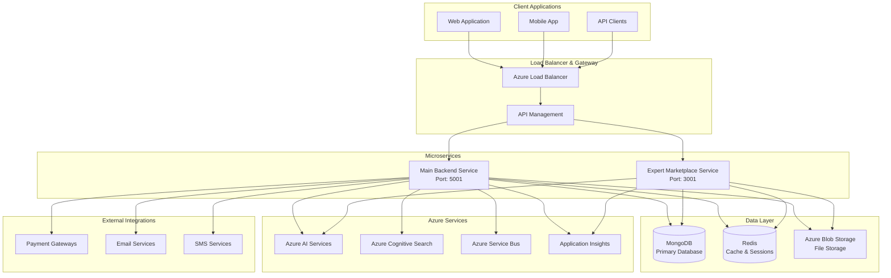
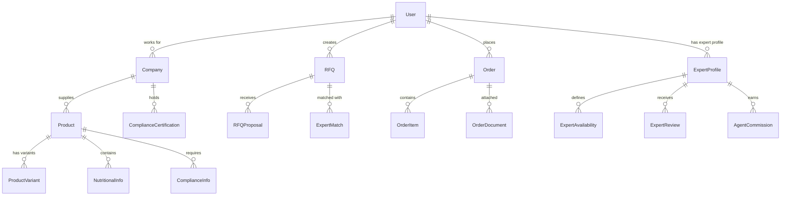
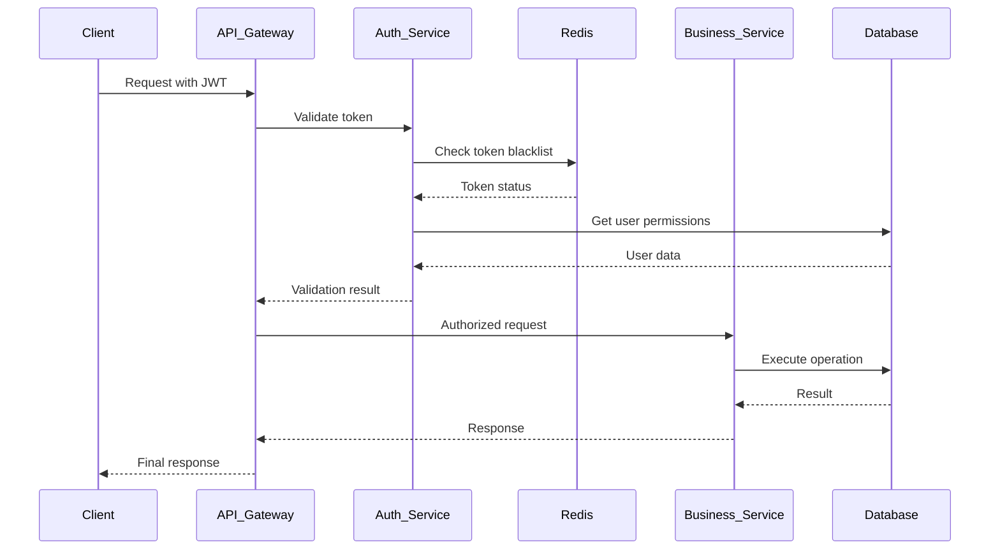
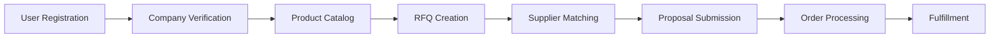
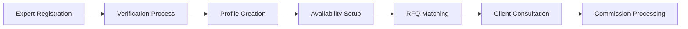
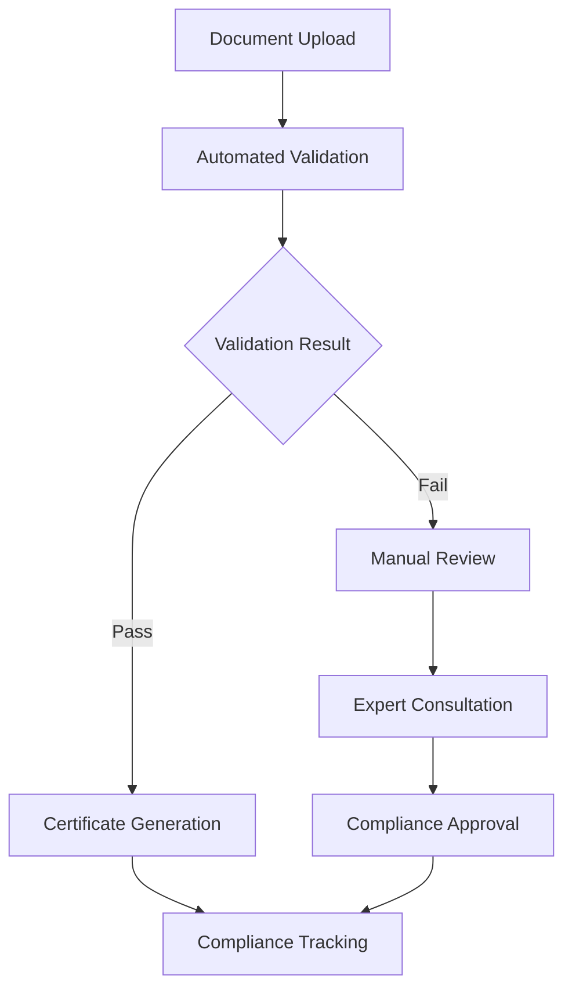
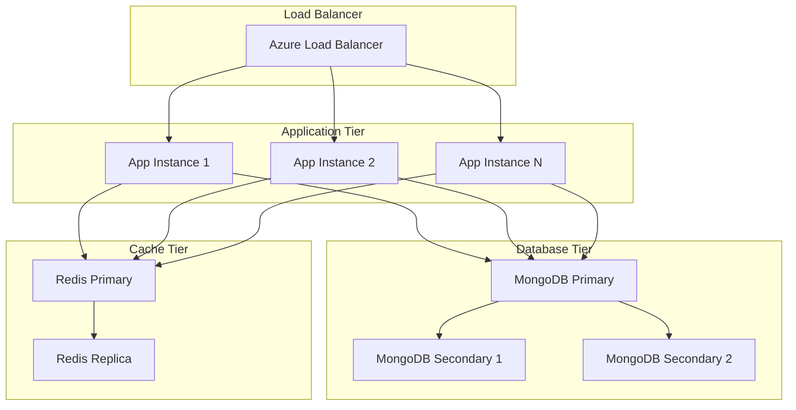
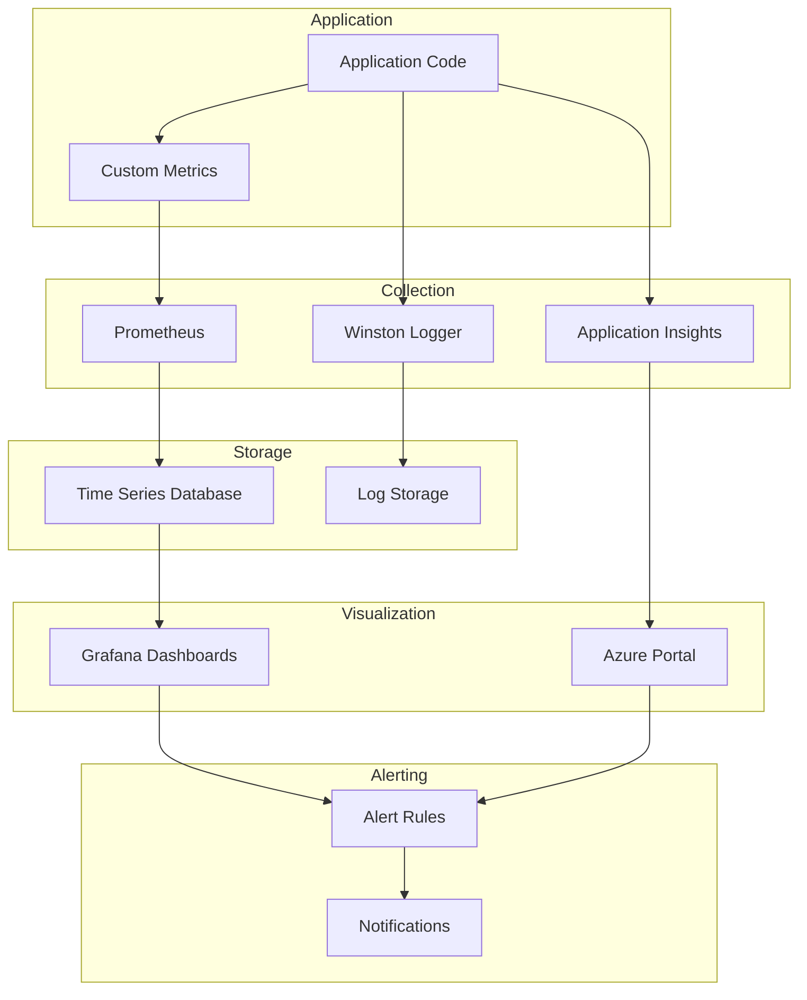
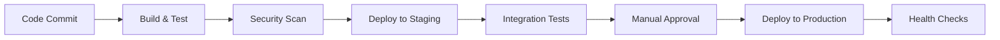

# FoodXchange System Architecture Overview

## Executive Summary
FoodXchange is a comprehensive B2B food commerce platform built on a microservices architecture using Node.js, TypeScript, and Azure cloud services. The system facilitates complex food industry workflows including RFQ management, supplier verification, compliance tracking, and expert consultations while ensuring food safety and regulatory compliance.

## High-Level Architecture



## Service Architecture

### 1. Main Backend Service (`/src/`)
**Purpose**: Core B2B marketplace functionality
- **Port**: 5001 (development), 80/443 (production)
- **Framework**: Express.js with TypeScript
- **Responsibilities**:
  - User authentication and authorization
  - Product catalog management
  - RFQ (Request for Quote) system
  - Order processing and fulfillment
  - Supplier and buyer management
  - Compliance validation
  - Payment processing integration
  - Core business logic

**Directory Structure**:
```
src/
├── api/routes/           # RESTful API endpoints
├── controllers/          # Request handlers and business logic
├── models/              # MongoDB schemas and data models
├── services/            # Business services and external integrations
├── middleware/          # Authentication, validation, error handling
├── config/              # Configuration management
├── infrastructure/      # Azure services integration
├── utils/               # Utility functions and helpers
└── types/               # TypeScript type definitions
```

### 2. Expert Marketplace Service (`/expert-marketplace-service/`)
**Purpose**: Specialized service for expert consultations and professional services
- **Port**: 3001 (development)
- **Framework**: Express.js with TypeScript
- **Responsibilities**:
  - Expert profile management
  - Expert-client matching
  - Availability scheduling
  - Commission tracking
  - Agent management
  - Real-time consultations
  - Expert verification

**Directory Structure**:
```
expert-marketplace-service/src/
├── controllers/          # Expert-specific controllers
├── models/              # Expert domain models
├── services/            # Expert business services
├── modules/             # Feature modules (rfq, agent, etc.)
├── middleware/          # Expert-specific middleware
├── config/              # Service configuration
└── utils/               # Service-specific utilities
```

## Technology Stack

### Backend Technologies
| Component | Technology | Version | Purpose |
|-----------|------------|---------|---------|
| Runtime | Node.js | 18.x/20.x LTS | JavaScript runtime |
| Language | TypeScript | 5.x | Type-safe development |
| Framework | Express.js | 4.x | Web application framework |
| Database | MongoDB | 7.x | Primary data storage |
| Cache | Redis | 7.x | Caching and session storage |
| Real-time | Socket.IO | 4.x | WebSocket communications |
| Authentication | JWT | - | Token-based authentication |
| Validation | Joi/Zod | - | Input validation |
| Monitoring | Prometheus | - | Metrics collection |

### Azure Cloud Services
| Service | Purpose | Usage |
|---------|---------|-------|
| Azure App Service | Web hosting | Production deployment |
| Azure Cosmos DB | Document database | Alternative to MongoDB |
| Azure Cache for Redis | Distributed cache | Session storage and caching |
| Azure Blob Storage | File storage | Document and image storage |
| Azure AI Services | Machine learning | Product analysis, recommendations |
| Azure Cognitive Search | Search engine | Product and expert search |
| Azure Service Bus | Message queue | Asynchronous processing |
| Azure Key Vault | Secret management | Secure configuration storage |
| Application Insights | Monitoring | Performance and error tracking |
| Azure API Management | API gateway | Rate limiting, security, analytics |

## Data Architecture

### Database Design

#### Primary Database: MongoDB


#### Collections Overview
| Collection | Purpose | Indexes |
|------------|---------|---------|
| `users` | User accounts and profiles | email, role, company |
| `companies` | Business entities | name, verification_status |
| `products` | Product catalog | category, supplier, name (text) |
| `rfqs` | Request for quotes | buyer, status, category, delivery_date |
| `orders` | Purchase orders | buyer, seller, status, created_date |
| `expert_profiles` | Expert information | expertise, location, rating |
| `agent_profiles` | Sales agent data | territory, commission_rate |
| `compliance_docs` | Compliance certificates | type, expiry_date, entity |

#### Caching Strategy (Redis)
```
Cache Structure:
├── Sessions: user:session:{sessionId}
├── API Cache: api:{endpoint}:{params_hash}
├── Product Cache: product:{productId}
├── User Cache: user:{userId}
├── Search Cache: search:{query_hash}
├── Expert Cache: expert:{expertId}
├── Rate Limiting: ratelimit:{ip|userId}
└── Blacklisted Tokens: blacklist:{tokenId}
```

## Security Architecture

### Authentication & Authorization Flow


### Security Layers
1. **Network Security**: Azure WAF, DDoS protection
2. **API Security**: Rate limiting, input validation, CORS
3. **Authentication**: JWT with refresh tokens
4. **Authorization**: Role-based access control (RBAC)
5. **Data Security**: Encryption at rest and in transit
6. **Audit Logging**: Comprehensive activity logging

## Business Logic Domains

### 1. Core Marketplace


### 2. Expert Marketplace


### 3. Compliance Workflow


## Integration Architecture

### Internal Service Communication
```typescript
// Service-to-service communication patterns
interface ServiceCommunication {
  // Synchronous HTTP calls for immediate responses
  http: {
    authentication: 'JWT tokens',
    timeout: '30 seconds',
    retries: 3
  };
  
  // Asynchronous messaging for background processing
  messaging: {
    queue: 'Azure Service Bus',
    patterns: ['pub-sub', 'request-response'],
    durability: 'persistent'
  };
  
  // Real-time communication
  websocket: {
    protocol: 'Socket.IO',
    authentication: 'JWT in handshake',
    scaling: 'Redis adapter'
  };
}
```

### External Integrations
| Integration | Type | Purpose |
|-------------|------|---------|
| Payment Gateways | REST API | Payment processing |
| Email Services | SMTP/API | Notifications |
| SMS Services | REST API | Alerts and verification |
| Shipping APIs | REST API | Logistics integration |
| ERP Systems | REST/SOAP | Enterprise system integration |
| Food Safety APIs | REST API | Compliance validation |

## Scalability & Performance

### Horizontal Scaling Strategy


### Performance Optimizations
1. **Database Indexing**: Strategic index design for query optimization
2. **Caching Layers**: Multi-level caching (Redis, CDN, application-level)
3. **Connection Pooling**: Efficient database connection management
4. **Lazy Loading**: On-demand data loading
5. **CDN Integration**: Azure CDN for static content
6. **API Pagination**: Efficient data transfer
7. **Background Processing**: Asynchronous task processing

## Monitoring & Observability

### Monitoring Stack


### Key Metrics
- **Application Metrics**: Response time, throughput, error rate
- **Business Metrics**: RFQ conversion rate, order volume, revenue
- **Infrastructure Metrics**: CPU, memory, disk, network usage
- **User Metrics**: Active users, session duration, feature usage

## Deployment Architecture

### Environment Strategy
```
Development → Staging → Production
    ↓           ↓          ↓
Local Dev   Azure Test  Azure Prod
```

### CI/CD Pipeline


### Infrastructure as Code
- **Bicep Templates**: Azure resource provisioning
- **Docker**: Containerization
- **Kubernetes**: Container orchestration (optional)
- **GitHub Actions**: CI/CD automation

## Disaster Recovery & Business Continuity

### Backup Strategy
- **Database**: Automated daily backups with point-in-time recovery
- **Files**: Geo-redundant storage with versioning
- **Configuration**: Infrastructure as code in version control
- **Secrets**: Azure Key Vault with backup keys

### Recovery Procedures
- **RTO (Recovery Time Objective)**: 4 hours
- **RPO (Recovery Point Objective)**: 1 hour
- **Multi-region deployment**: Primary (East US), Secondary (West Europe)
- **Failover strategy**: Automated for database, manual for application

## Future Architecture Considerations

### Planned Enhancements
1. **Microservices Expansion**: Break down monolithic components
2. **Event-Driven Architecture**: Implement event sourcing
3. **API Gateway Enhancement**: Advanced routing and transformation
4. **Machine Learning Pipeline**: Enhanced AI capabilities
5. **Blockchain Integration**: Supply chain traceability
6. **Mobile-First API**: Optimized mobile endpoints

### Technology Roadmap
- **Container Orchestration**: Kubernetes adoption
- **Serverless Functions**: Azure Functions for specific workloads
- **GraphQL**: Flexible API queries
- **Progressive Web App**: Enhanced mobile experience
- **Edge Computing**: Reduced latency with edge locations

This architecture provides a robust, scalable foundation for the FoodXchange B2B marketplace while maintaining flexibility for future growth and feature additions.